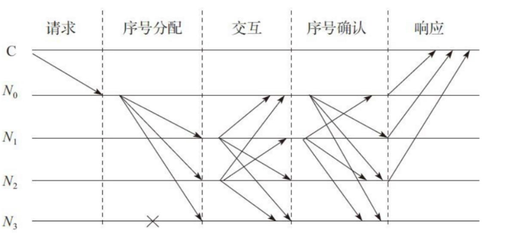
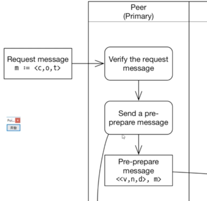

### PBFT一致性协议

- 叛徒的数量大于等于1/3,这个问题是无解的。

- 一致性：每个忠诚的将军必须受到相同的命令vi(vi是第一个将军的命令)
-

-  一致性协议至少包含请求(request),序号分配（pre-prepare），响应(reply)三个阶段。根据协议设计的不同，可能包含互相交互(prepare)，序号确认(commit)等阶段。

- PBFT系统通常假设故障节点个数m个，而整个服务节点为3m+1

- 

- 

c:客户端id
o:客户端请求的具体消息 
t:消息发送的具体时间

v:视图id
n:请求id
d:hash值 

