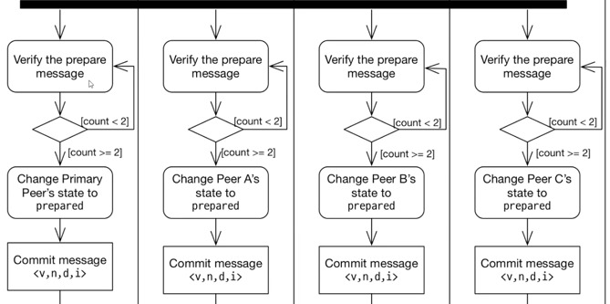
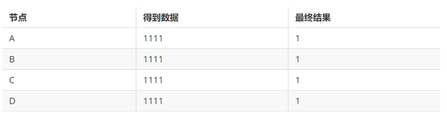
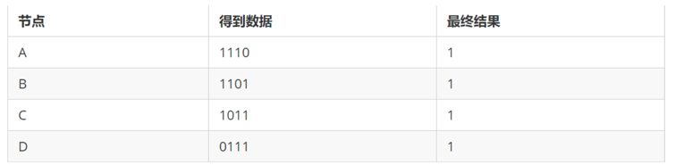
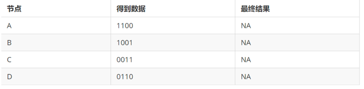
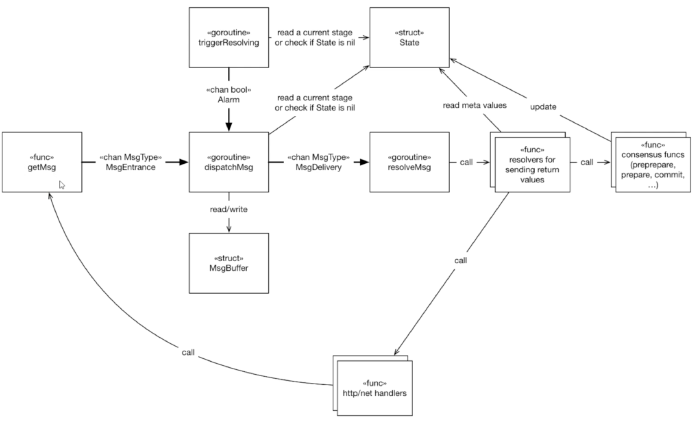

### PBFT一致性协议

- 叛徒的数量大于等于1/3,这个问题是无解的。

- 一致性：每个忠诚的将军必须受到相同的命令vi(vi是第一个将军的命令)
-

-  一致性协议至少包含请求(request),序号分配（pre-prepare），响应(reply)三个阶段。根据协议设计的不同，可能包含互相交互(prepare)，序号确认(commit)等阶段。

- PBFT系统通常假设故障节点个数m个，而整个服务节点为3m+1

- 

c:客户端id
o:客户端请求的具体消息 
t:消息发送的具体时间

v:视图id
n:请求id
d:hash值 

- 

- 

v:视图id
n:请求id
d:hash值 
i:发送消息的节点

- 

v  视图编号
t  时间戳
c 客户端ID
i  发送消息的节点编号
r  操作的结果

- 大于等于2  

- 

### PBFT演示 

- 在 n ≥ 3m + 1 的情況下一致性是可能解決的，其中，n为总节点数，m为恶意 节点总数
- n=4,m=0

- n=4 m=1 

- n=4 m=2

- 实用拜占庭容错系统能够容纳将近1/3的拜占庭节点
- 实用拜占庭容错系统在很多场景都有应用，在区块链应用中，一般适合于对强一致
性有要求的私有链和联盟链场景。例如，在 IBM 主导的区块链超级账本项目中， 实用拜占庭容错系统是一个可选的共识协议

- 如果多个消息，后来的消息存储到msgBuffer里面。msgBuffer是有限的，如果超出，Alarm 缓冲区的msgBuffer清理一下。